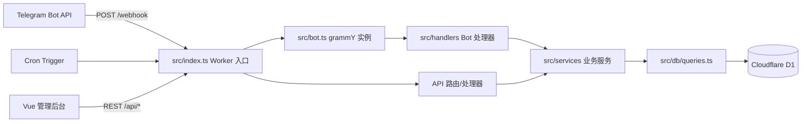

# 架构设计

## 概述

项目是一个 Telegram 资源分发机器人：Bot 后端运行在 Cloudflare Workers 上，使用 grammY 处理 Telegram Webhook，使用 D1 存储用户、资源、下载、签到、广播、广告、设置与日志数据；Vue 3 管理后台通过 Worker 提供的 REST API 管理全部数据。

## 架构总览

## 目录职责

| 路径 | 职责 | 任务归属 |
|------|------|----------|
| `wrangler.toml` | Worker 配置：D1 绑定、Cron Triggers、环境变量 | 0 |
| `package.json` / `tsconfig.json` | 依赖、脚本、严格 TS 配置 | 0 |
| `src/index.ts` | Worker 入口：健康检查、webhook/cron 分发、`/api/*` 路由挂载 | 0、6 |
| `src/bot.ts` | grammY bot 实例、中间件、处理器注册 | 4、6 |
| `src/db/schema.sql` | D1 建表语句 | 1 |
| `src/db/queries.ts` | 所有数据库读写操作 | 1 |
| `src/types.ts` | 共享类型定义 | 2 |
| `src/utils/` | 短码生成、管理员校验、通用工具 | 2 |
| `src/services/` | 订阅验证、风控、积分、广告、统计 | 3、5 |
| `src/handlers/` | start/resource/group/points/admin/broadcast/settings | 4、5 |
| `admin/` | Vue 3 管理后台 | 7 |
| `migrations/` | D1 迁移 SQL | 1 |

## 数据流

### Bot 更新链路

Telegram Bot API → `POST /webhook` → `src/index.ts` → `src/bot.ts`（grammY）→ `src/handlers/` → `src/services/` → `src/db/queries.ts` → D1，处理完成后通过 Bot API 回传消息。

### Cron 链路

Cloudflare Cron Trigger → `scheduled` 事件 → `src/index.ts` → 签到重置 / 定时广播检查 / 统计预聚合等服务 → D1 与 Bot API。

### Admin 链路

浏览器 → Vue 3 管理后台 → REST API（Worker `/api/*`）→ 鉴权（JWT + 可选 IP 白名单）→ API 处理器 → 业务服务 → D1。

## 任务归属

| 任务 | 内容 | 主要产出 |
|------|------|----------|
| 0 | 脚手架 + wrangler + 基础结构 | 根配置、`src/index.ts` 健康检查、目录骨架、README、本文件 |
| 1 | D1 Schema + queries.ts | `src/db/schema.sql`、`src/db/queries.ts`、`migrations/` |
| 2 | 工具函数与类型定义 | `src/types.ts`、`src/utils/*` |
| 3 | 核心服务 | `src/services/subscription.ts`、`rate-limit.ts`、`points.ts`、`ads.ts` |
| 4 | Bot 处理器 | `src/bot.ts`、`src/handlers/start.ts`、`resource.ts`、`group.ts`、`points.ts` |
| 5 | 管理员功能 + 广播 + 定时 | `src/handlers/admin.ts`、`broadcast.ts`、`settings.ts`、`src/services/stats.ts` |
| 6 | Worker 入口 | `src/index.ts` webhook 与 cron 入口、REST API 路由 |
| 7 | Vue 管理后台 | `admin/` 完整前端 |
| 8 | 整体联调与安全加固 | 全项目 |

## 关键约定

- 所有时间相关操作使用 UTC，展示时转换为本地可读格式。
- 短码为 8 位随机码，生成时必须保证唯一（碰撞重试）。
- 管理员 user_id 通过环境变量 `ADMIN_IDS` 配置（逗号分隔）。
- 管理后台密码通过 `ADMIN_PASSWORD_HASH` 配置（bcrypt 哈希）。
- 后台敏感接口必须验证 JWT，并支持可选 IP 白名单。
- 错误处理完善，避免 Worker 崩溃；关键逻辑保留中文注释。
